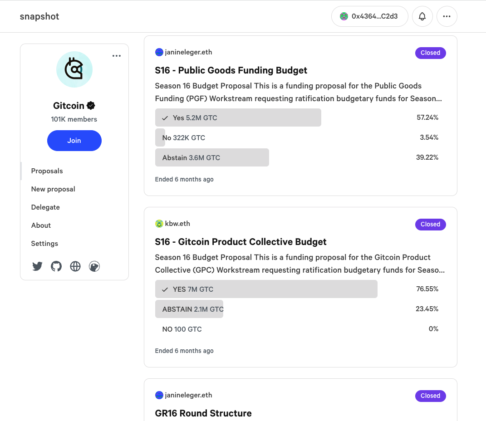

## Application design and overview

This tutorial can be completed in 2 parts, each section building on one another:

* In the first part, you will learn how to build a P2P22 Staking contract. Our Voting dApp’s logic is based on the fact that users need to acquire this special PSP22 token in order to vote or propose items to be voted on. For simplicity, we assume that the tokens will be distributed by the contract owner.

* In the second part, we'll create a separate Voting contract which can make calls to the Staking contract.

You can imagine this dApp being used amongst members of a DAO to vote on proposals, using a similar UI as [Snapshot](https://snapshot.org/#/):

 

<!-- slide:break -->

<!-- tabs:start -->

  
  

 

*Overview of the architecture of the Voting dApp we're building.*

<!-- tabs:end -->