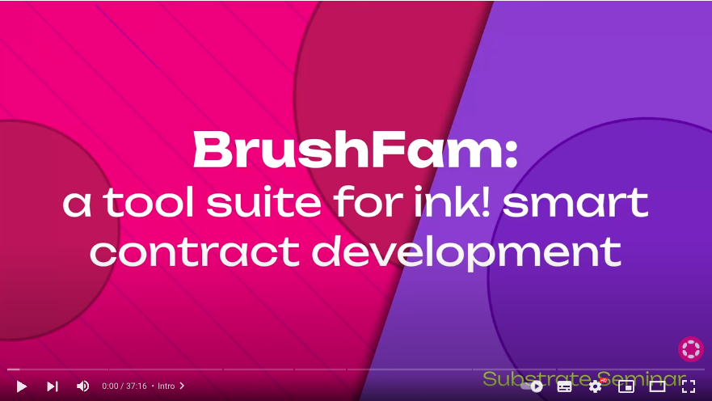

# Build a Voting Dapp tutorial

**Author**: Sacha Lansky

**Maintainers**: Sacha Lansky

**Source code**: 

**Intended audience**: Beginners/Intermediate

**Topics**: ink!, OpenBrush, Governance

Welcome to the Polkadot voting dApp tutorial. In this tutorial, you’ll learn how to build a dApp in the [ink! programming language](https://use.ink/) using [OpenBrush](https://openbrush.io/) - an ink! smart contract library. You'll also learn how to write tests for it and interact with it using a front-end. This tutorial is based on the [Substrate Seminar](https://substrate.io/ecosystem/resources/seminar/) introducing [BrushFam](https://brushfam.io/) (see the full video below) which is recommended material to watch before diving into this tutorial.

The voting app you’ll be building is for educational purposes and is not meant to be shipped to production. However you’ll learn the basics of creating a multi-contract dApp that implements staking and voting logic for a simple application that allows users to vote and propose items to be voted on. **It’s meant to be fun, educational and somewhat applicable to a real world use case.** 😊

<!-- slide:break -->

<!-- tabs:start -->

## What you'll learn

- Use and extend a PSP22 contract
- Implement Staking and Voting logic using OpenBrush's trait implementation pattern
- Create cross-contract calls

> **Note:** this tutorial is not designed for complete beginners. It is designed such that each part builds on top of one another.

## Prerequisites

- Complete the [beginner’s ink! tutorial](https://docs.substrate.io/tutorials/smart-contracts/develop-a-smart-contract/) (this implies that you have Rust and Cargo Contract installed on your machine) 
- Know basic Rust
- Have a wallet chrome extension to sign transactions

## Tools

The tools you’ll be exploring in this tutorial are: 

- [ink!](https://use.ink/) - a DSL for writing Wasm smart contracts for Substrate chains.
- [OpenBrush](https://openbrush.io/) - a smart contract library and framework for developing dapps.
- The [Contracts parachain](https://use.ink/testnet#what-is-the-contracts-parachain) on Rococo - a Polkadot-like live testnet.
- The [Contracts UI](https://contracts-ui.substrate.io/) - a UI to easily deploy contracts to [Rococo](https://substrate.io/developers/rococo-network/).

<!-- tabs:end -->