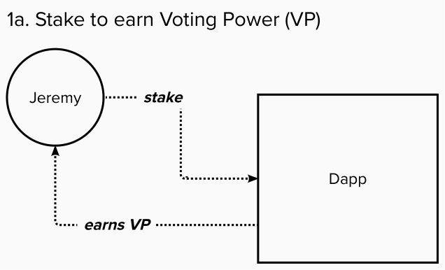
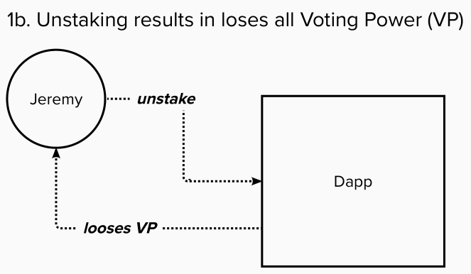

# User journey

In this first section we’ll create a Staking contract to issue some tokens on-chain and allow users to *stake* an amount — which will give them some Voting Power (VP) — and to *unstake* an amount — which will take away their Voting Power. VP will be an important part of our dapp’s overall logic once we write the Voting contract in the next part of this tutorial. For now, just think of it as a unit of account that users of our dApp can only acquire by staking the PSP22 token we’ll create.  

Let’s imagine a user, Jeremy who is eager to vote on proposals found on this voting dApp. The first thing he’ll need to do is to acquire some tokens, which he asks his friend for. The more tokens he stakes, the more initial voting power he receives. But when he un-stakes his tokens, he’ll lose all voting power. Because voting power is contingent on the user staking, we’ll really be doing two things in this part:

  

- Implement the PSP22 standard to create a supply of staking tokens
- Extend our implementation to include a function that returns some Voting Power based on the active amount staked. For calculating voting power, we’ll use a simple linear decay function to calculate the voting power at a given time since the last stake :
    
    f(t) = CX - r*t
    
    - where C denotes a constant for a 30 day period in Unix time
    - X is the amount of stake
    - r is the decay

The rules we’ll enforce in our Staking contract logic are: 

- Only 42_000_000 tokens will initially be issued
- Voting Power can only be earned as a function of how a user stake, following a linear decaying amount of Voting Power over time
- Users can add stake to earn more voting power at any time
- For any amount staked, the contract will lock those funds for another 1 month

> 📝 Note that our Staking logic is very simplified — there’s a lot more you can do to improve the overall voting dApp once you get these basics down. **Please note that whatever it is you end up building in this tutorial, none of the code should be considered production ready and is only meant for educational purposes. For example, outside the scope of this tutorial you could add inflation for token supply and allow users to chose lock-up periods to increase voting power or implement a different way for users to gain voting power to make it more decentralized.**
